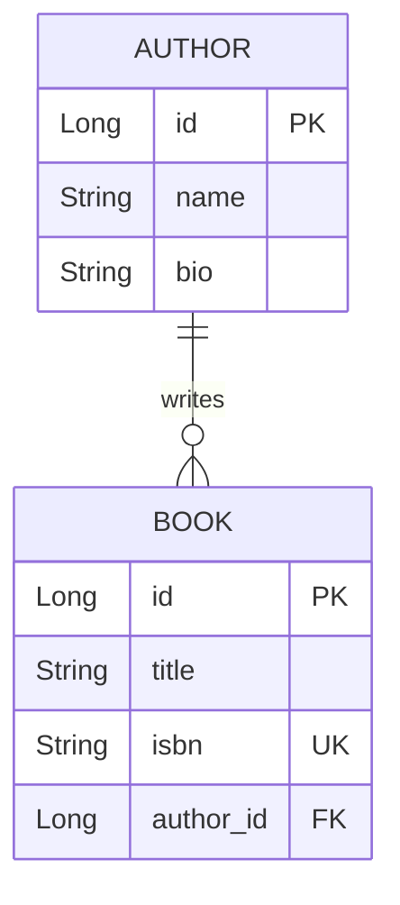

# 📚 NextGen Library Management System


A robust, enterprise-grade Spring Boot web application designed to seamlessly manage library inventory. Developed with a strong focus on clean architecture, this application handles relationships between authors and their publications, demonstrating full CRUD (Create, Read, Update) capabilities, server-side rendered views, and transactional data integrity.

---

## ✨ Key Features

- **Relational Data Mapping:** Architected with Spring Data JPA to seamlessly map one-to-many and many-to-one entity relationships.
- **Optimized Queries:** Eliminates the infamous N+1 query problem using custom JPQL `JOIN FETCH` queries for lightning-fast read operations.
- **Graceful Error Handling:** Employs advanced Controller logic to intercept SQL integrity violations (e.g., duplicate ISBNs) and provide user-friendly feedback without breaking the application state.
- **Responsive UI:** Features a server-side rendered JSP front-end powered by JSTL, styled with modern, lightweight CSS for a premium aesthetic.
- **Automated Seeding:** Automatically boots up with an H2 in-memory database pre-loaded with classic literature records.
- **TDD Practices:** Supported by comprehensive unit test suites utilizing JUnit 5 and Mockito.

---

## 🛠️ Technology Stack

- **Backend:** Java 17, Spring Boot 3.2.x, Spring Web MVC
- **Persistence:** Spring Data JPA, Hibernate, H2 In-Memory Database
- **Frontend:** JSP (JavaServer Pages), JSTL, Custom CSS
- **Testing:** JUnit 5, Mockito
- **Build Tool:** Maven

---

## 📐 Entity Relationship Architecture

The system is built upon a rigid relational database schema:


*An `Author` can write multiple `Book`s (One-To-Many), and a `Book` is associated with precisely one `Author` (Many-To-One).*

---

## 🚀 Getting Started

Follow these instructions to get a copy of the project up and running on your local machine for development and testing purposes.

### Prerequisites

Ensure you have the following installed on your local machine:
- [Java Development Kit (JDK) 17](https://www.oracle.com/java/technologies/javase/jdk17-archive-downloads.html) or higher
- A Java IDE (VS Code, IntelliJ IDEA, or Eclipse)

### Installation & Execution

**1. Clone the repository**
```bash
git clone https://github.com/YourUsername/library-management-system.git
cd library-management-system
```

**2. Run the application**
- Open the project directory in your preferred IDE.
- Let the IDE resolve the Maven dependencies via the `pom.xml`.
- Locate the main bootstrap class: `src/main/java/com/example/library/LibraryApplication.java`.
- Execute the `main` method.

**3. Access the Application**
Once the Spring Boot logo appears in your terminal and the server starts on port `8080`, open your web browser and navigate to:
```text
http://localhost:8080/books
```

---

## 🧪 Testing

This project maintains code quality through isolated unit tests covering both the repository logic and the service layer business logic. 

To execute the test suite, run the test classes directly from your IDE's test explorer:
- `BookRepositoryTest.java` (Tests custom inner join queries)
- `LibraryServiceTest.java` (Tests isolated business logic with Mockito)

---

## 👨‍💻 Author

**T.Abdul Kalam Azad**
---

